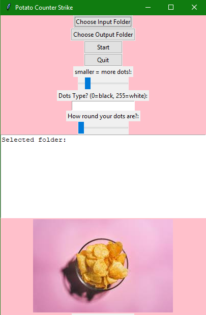
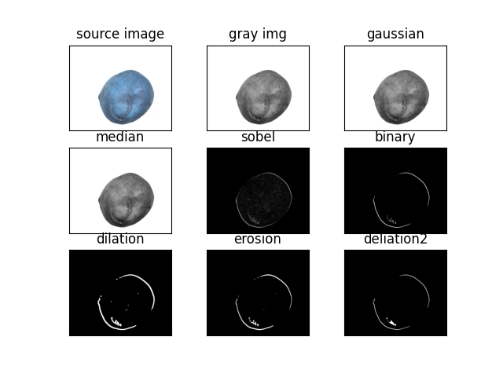

# Potato Counter Strike

This software is using opencv, tk for potato dots counting. 
THe accuracy is not 100% but with classic algorithm it should be enough for covering daily usage. 

For binary version, auto-py-to-exe is used, you can install it by: 
```
pip install auto-py-to-exe
auto-py-to-exe
```
It is still under development for C++ version with Qt6. 

UI: 
<p align="center">
  
</p>

Brain Storm: 
<p align="center">
  
</p>

If you have any problems please don't be shy and write me a ticket from Issue function.  
